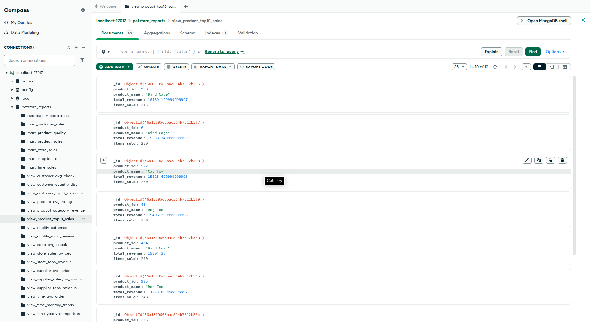
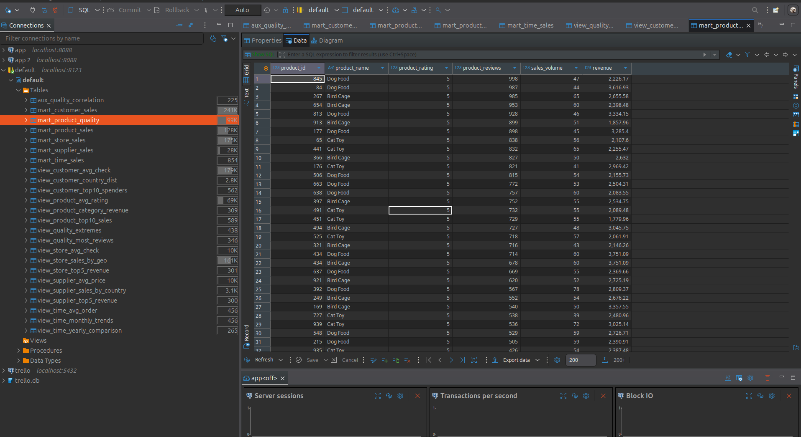

# BigDataSpark

Анализ больших данных - лабораторная работа №2 - ETL реализованный с помощью Spark

### Скрипты

Все скрипты обработки данных запускаются в рамках контейнера (на основе контейнера spark собирается контейнер с необходимыми зависимостями и драйверами для наших скриптов, живет только до конца обработки данных).
Скипта три:
- entrypoint.sh - проверяет доступность БД и запускает скрипты-обработчики
- transform.py - использует spark для построение схемы звезды
- reports.py - формирует отчёты (6 витрин и 18 представлений в соответствии с заданием)

### Запуск
Через вызов ```make``` или вручную
```
docker-compose down -v
docker-compose build
docker-compose up
```

### Скриншоты



